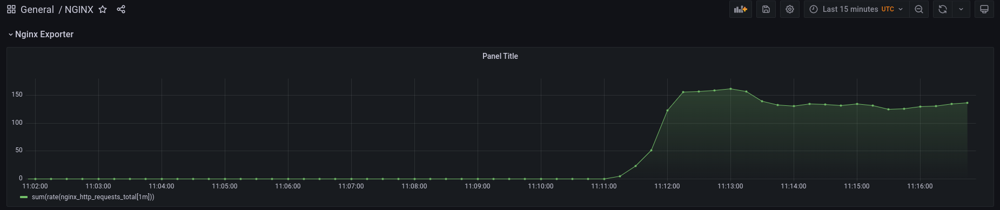

### Kubernetes-monitoring

1\. Подготавливаем минимальную конфигурацию NGINX с `location` для `stub_status` в ConfigMap

2\. Добавляем ConfigMap как volume в deployment по стандартному пути _/etc/nging/nginx.conf_

3\. Применяем все манифесты:

```bash
$ kubectl apply -f kubernetes-monitoring/nginx-configmap.yaml
$ kubectl apply -f kubernetes-monitoring/nfinx-deployment.yaml
$ kubectl apply -f kubernetes-monitoring/nginx-service.yaml
```

4\. Для создания CRD ServiceMonitor используем официальный репозиторий kube-prometheus:

```bash
$ git clone https://github.com/prometheus-operator/kube-prometheus.git
$ kubectl apply -f kube-prometheus/manifests/setup
$ kubectl apply -f kube-prometheus/manifests
```

5\. Добавляем ServiceMonitor для NGINX:

```bash
$ kubectl apply -f kubernetes-monitoring/nginx-servicemonitor.yaml
```

6\. Проверяем работу в интерфейсу Prometheus:

```bash
$ kubectl --namespace monitoring port-forward svc/prometheus-k8s 9090
$ open 'http://localhost:9090'
```

```promql
sum(rate(nginx_http_requests_total[1m]))
```


